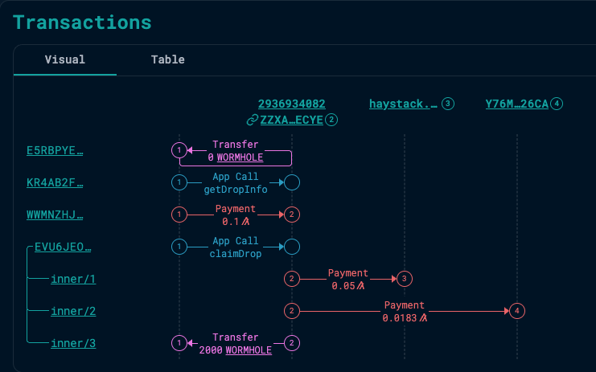
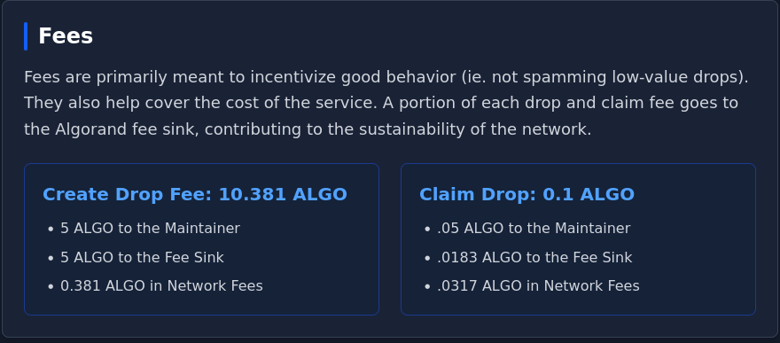

_This is presented as a personal opinion piece. Views presented here are mine except when explicitly attributed._

Algorand fee sustainability has recently come back into the community spotlight.

In this debate, there is considerable traction behind the notion that increasing the minimum transaction fee will negatively impact adoption: high volume applications may reduce their on-chain volume (or stop altogether) and certain use cases - micropayments or microinteractions - may no longer be viable on Algorand.

Personally, I would avoid raising the minimum transaction fee for now, as I think it would be simultaneously too much (see above) and too little (would not make enough of a positive impact on sustainability vs its anticipated costs.)

I think we have the time to experiment with innovative ways to bridge the sustainability gap, and this proposal could be a part of the solution. It was originally proposed by [grzracz](https://x.com/grzracz), founder of Vestige.

## Proposal

Encourage application developers to require "excess" transaction fees - that is, more fees than required by the protocol:

1) Application developers can suggest (or enforce) "excess" fees in their application calls
2) Excess fees generated by applications are partly rebated to the application developer

## Benefits

- Creates small revenue stream for developers
- Incentivizes high transaction volume applications
- Depending on the rebate percentage, the Foundation funds the fee sink at break-even or at a discount
- Can be implemented without protocol change (as a pilot)

## Implementation Decisions

**How is the application developer revenue address determined?**

It won't always be as simple as "application creator address" - e.g. we need to consider cases where applications are created by other applications (registry/deployer pattern.)

**Is this an opt-in system, or in effect by default?**

Opt-in has the following advantages:

- Easier to ensure the correct recipient. The developer would opt in by providing their creator addresses and all created applications would be found recursively.
- Ability to provide a separate rebate revenue address than the application creator accounts.
- Applications could intentionally not opt in as a way of giving back. See below.

**More decisions**

- Secondary benefits beyond rebate
  - For this to be appealing, there may need to be secondary benefits beyond the rebate
  - Application developers may as well require a payment fee and keep 100% of it

- Applications could intentionally use excess fees and not opt in as a means of "giving back" on the protocol level.
  - Different use cases on Algorand have different cost margins. For a real estate tokenization platform and its customers, a tenfold increase of network fees may go entirely unnoticed (e.g. $0.0024 vs $0.00024)
  - Could provide an explicit opt-out mechanism so that applications can specify that their share of excess fees should not be split in grouped calls

- Codify mechanics of splitting fees between different applications in a transaction group
  - Split excess fees between all opted-in applications?
  - Exclude portion of explicitly opted-out applications?

## Suggestion vs enforcement

From the developer point of view, excess fees could either be suggested or enforced:

- suggested: dApp frontends encode higher fees. The smart contract does not enforce them as a requirement.
- enforced: the smart contract itself enforces a minimum excess fee for app calls.

An implementation consideration that was pointed out by [withheld] is that for composable protocols (e.g. a DEX) the "suggested" approach would likely be preferable to preserve ease of composability. For example, a DEX swap may be called by a swap router smart contract instead of directly. In these cases, fees are almost always paid in the outer application call to the router contract, instead of the DEX contract itself, so the DEX contract would see zero fees being paid in its own application call.

## Why bother? You can already code this in a smart contract

This is certainly possible, and even practiced: excess fees are already coded into smart contract logic, such as in Reti pooling, or the recently released [Haydrops](https://drops.hay.app/drops):

> Pictured: example of a haydrop "claim".
> User pays .1 ALGO - portion used for MBR, portion goes to maintainer, rest goes to fee sink.
> Total of 0.0253 to fee sink.

> Excerpt from [Haydrops docs](https://drops.hay.app/docs)

And of course dApps require platform fees already as standard practice, which they keep entirely.

I believe it is still worth making this a proper incentivization mechanic:

- incentivizes builders to use excess fees
  - standardizes excess revenue sharing between fee sink / block proposer & dApp developer
- incentivizes high transaction volume use cases
- easier & more accessible to dApp developers than coding it on a smart contract level
- accessible to existing smart contracts, that do not encode this logic already

## Variant: incentivize new applications only

I would be remiss not to mention Grzracz original intention for this, which is to only incentivize applications after a certain threshold - in other words, new applications deployed after this mechanic is implemented.

The rationale behind this is to focus the incentive to attracting builders, and lead them to high volume applications as well.

Personally I would leave it open to all applications, new and old. From the "purse" point of view (Algorand Foundation) this strategy can be designed to be delta-neutral at worst, or even as a cost-saving (funding the fee sink at a discount.)

## Afterword

 I hope he idea of "giving back" to the protocol catches on, at least where it can be afforded. It would help keep the absolute minimum transaction fee as low as it is today, in order to facilitate use cases where it isn't affordable to increase fees: micropayments, microinteractions, etc.

 As we have seen with the recently deployed protocol staking, incentives work. The altruistic concept of spending more to give back to the node-runners and fee sink protocol would probably do very well when paired with a monetary incentive to do so, even if this monetary incentive is low.

 Personally I would like to hear feedback on this idea, and then experiment with a pilot implementation if it is considered worthwhile.
