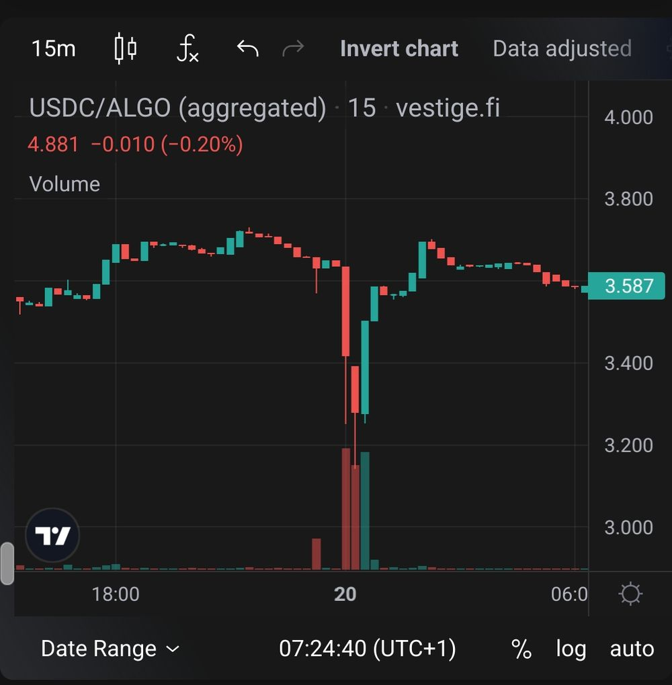

The MyAlgo attacks have so far been clustered around three distinct
waves, roughly corresponding to these dates:

First Wave: February 20, 2023\
Second Wave: March 5, 2023\
Third Wave: March 6, 2023

This article presents data from the initial wave - February 20 - as well
as subsequent movements of stolen funds during March 5th. Wallets
attacked on March 5th are not included.

Aggregates and Addresses
------------------------

In the first wave, 24 addresses were impacted for the following
aggregate losses:\
\
16,964,466.38 ALGO\
3,440,465.51 USDC\
1,515,710.00 OPUL\
800,000.00 gALGO\
1,237,828.90 COSG\
40,252,507.58 goMINT\
230.37 goETH\
15.85 goBTC\
2,713,794.69 BANK\
\
The approximate value at the time was \$9.4MM.\
\
The impacted addresses are:

```none
26CRE7V2TPFKA7L5SLMSQW6YSZ5GLSIVRZINGO24C6Y6YKHTYVZLKPFWGM
3PLI5DQRPE3WJBXK7IWYKB7CR3K76QNYAFPBVOGBBWY2TJG7KPWRIJIC4A
AIRFOUDOHO37NAV5O7NNSKCFHVDQKP46U5IHSN6D7XQVWROYXBZNU7QEQ
BNJVT3P3B4PRR4GVNXD5ZUWKNXZ6WB6QQ35TJJVFVOLJV47CVZXOBW4UAU
FHN2CDLPUGRBIZ3YDRLB3T2PLTXHXL23SXWYZAVW66GYYCI62AL35PTJ7Q
GLAXZZUWBRJ5KVXU7D3CLTOKNMDUL4TA3NRQTOLPVUBYLYGV5N732OEX4A
H3Y634PNDDHLSYIA2UUMXOUN5FOCMJEDFOFCPA6WPGG5AQAJRKNPFQL7WY
H65YELCBPRTNKPLYPIL4UW7VWJ4E52227QW3ZYKIHRKJO46P2JZUPNW3TY
HTCESSSDUU2JBBVPOS7EJ4GDHFXPUDK2TVDNTDZYKJOFLSJN7ORJQCTTKU
I7TKXLELT7V6OXLT76OCJ6H74U73UNKJZUBMNDDHNSG65QQB5UOY7EVURY
IVSTVERD2KNSM4MKTSMWFRHZLMEKXIOVCCDGM2PI7ISNK3FHJJCI53HUNY
JKPP3NDDGPNHSVNEYZL5HDKD56K4JG5R4GPHTMSPM6EJM6MM4BCENII33I
JNBW7AMBSFEDLBCWJA6EJLDFMZQKWDS7YK2F6FQUJM2VQT6KNN44X77JQE
KJGVU75NBKJG52JJ7BFSQZ664UJT7JRIS3V7ZGBR464QSOAKQLWALPGEYU
M5YTAZJJJFAZZ2BANOT2A7BF7ZCQ5WW6QL43JI3WE5CNH5SXPCXY4GM36A
O62QU75IDI7EVM7ZZZCJTAZULZQLJV6RXOKBAMQNSR3S4DALGC62G5EPKQ
O74MYOAFM4KJ5G72IBKGRQKXU43M75VIDEUH6TNCUNRLBXI5SXI7GRQHYQ
OLM2Y25BNLA3LIIIAN2J65BOXRHCSPIGOCV5KXJ75JUPGZRIAIBVKAHHSA
QPOQMWKLA2XOULRJRZGIHPMVH6XM3GPO6FISZEJQ5OWN6AMF33M6JI7MV4
VO57GKHQKCQLIV3WSTVVVP4M6YC3GVI3ASA6JOFXGEQJD6VFZK6Z53VF3E
XCCFG56BW3YF3MXBHVNQ4MP2OF6V54XB2UOJWKOYPJQPPUHNSTONGXZGSM
XD6TQN6BT6AJG7LPORDUZGLKOFM5NKKG3Z7IZMPEIR6O3EATNEEGYL4DTU
XIH4JVQAVE6IUQZI6XDUEI624FP7A64RCC5PXDBOQNYHTAAT7325MLLH74
ZKEFAKXB5H4J64OPS3362AWCW4SJ3ICPEG6J422GAN7O6KDKB4Q5KFNISQ
```

Transactions
------------

You can find a timeline view of all attacker transactions relating to
these accounts in [this
spreadsheet](https://docs.google.com/spreadsheets/d/14oMZQ07n2aCpKcRqWf1hQu8Umtv04iJIwDldzDWYyro/edit?usp=sharing).
Atomic group transactions have been parsed down to inputs and outputs
with respect to the address interacting with the contract. If you spot
any mistakes or inconsistencies, please let us know.

Observations
------------

Several DeFi platforms were used for swapping, lending & borrowing.

It is interesting to note that the attackers
[swapped](https://allo.info/tx/group/JKBurgcWvPGmz4K06MIP5rjOgHxDpcAgN8PqxqKWwWg%3D)
[300,000](https://allo.info/tx/group/hrr4Ff1YTnO64FZG0aXS8qJG2XHPJkh4lQxhsc74%2FxM%3D)
[USDC](https://allo.info/tx/group/kL4%2B6vdCOaS6kII0ox0x7LbHSVS1l7PR9lflEGKQs3s%3D)
on-chain and in quick succession on February 20th, causing a sharp dip
in USDC price. The remaining USDC was deposited into an exchange.



Some of the attacker accounts controlling these funds became active on
March 5th.

We highlight [an
account](https://allo.info/address/J6NFGQYSBAEBLVTJCOCCQAJ52KJIHZMWNGHVGZTSMMW4MXHN5J65G2PQYA)
controlled by the attackers that held a significant amount of goBTC and
goETH. They caused two similar dips to the goBTC/ALGO pair after
swapping goBTC.


The remaining goBTC and goETH were
[deposited](https://allo.info/tx/group/BrFrqgkRSSPAnnW7y8BvabSDLWojhMTfn0k%2FhBL5W4Y%3D)
[as
collateral](https://allo.info/tx/group/eUW9%2F47eKl%2Fp4IRz35nd5cUCfMxQfULY7wYGkl08hRY%3D)
on AlgoFi and ALGO was
[borrowed](https://allo.info/tx/group/qclCbfuUic%2BEg8%2BOFR5sWQG1jLZYSKySLHqZvPJQvEw%3D)
against it.

March 5th also saw new attacks on users with large asset holdings. Data
for this second wave will be released in a few days.

------------------------------------------------------------------------

If you were impacted by this, first you need to get in touch with your
local Law Enforcement.

Then you should submit a report on
[https://wallet.myalgo.com](https://wallet.myalgo.com/)


If you have any information or require help from the investigation &
response team, please reach out to any of the following:

[MyAlgo](https://wallet.myalgo.com/) / [RandLabs](https://randlabs.io/) - [nimble](https://twitter.com/insurenimble) - [VP Blockchain](https://twitter.com/VantagePoint_BC) - [D13](https://twitter.com/d13_co)
