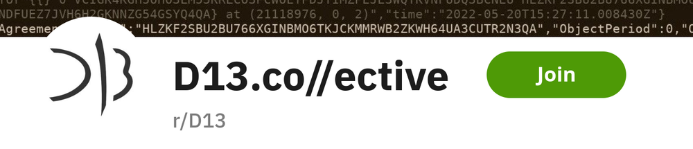

As we\'re launching our first Algorand product soon, we wanted to have a
space where people can reach out and talk to us.

We were a bit surprised to find that
[/r/D13](https://reddit.com/r/D13)
was available as a subreddit! We promptly claimed it and are in the
process of filling it out with some content.

If you want to ask us anything, feel free to drop by and post.

Visit our subreddit:
[/r/D13](https://reddit.com/r/D13)
