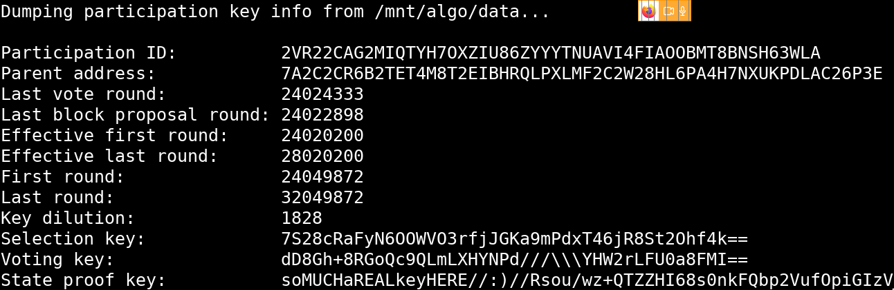
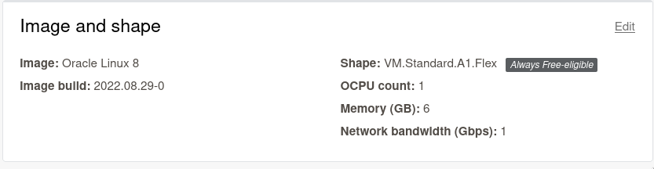
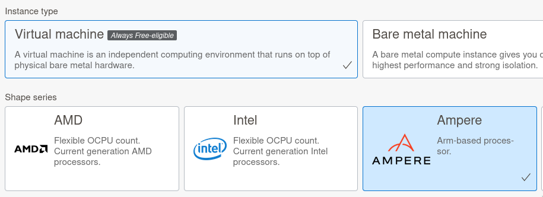
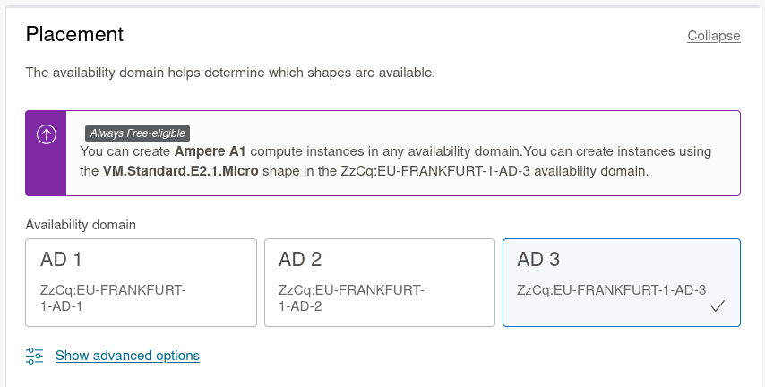

Running an Algorand consensus participation node requires a bit of
patience and a bit of hardware.

Unfortunately, consensus participation currently isn\'t rewarded by the
network - only by our conscience! Most cloud providers do not accept
conscience bucks, so we will do what we can with free offerings.

The Oracle Cloud has an \"always free\" tier which includes good-enough
virtual servers for our purposes. Traditionally this is where I state my
affiliations and paid promotions, but there are none in this case. ~~I am
a happy Oracle free tier user and that\'s it.~~ No money has exchanged
hands for the production of this article. There is one minor gotcha
which I will treat as a cliff-hanger for now.



If you are going to host your participation node elsewhere, [skip to
step 5](#step-5-install-algod).

Step 1: Set up an account on Oracle Cloud
-----------------------------------------

[Go
here](https://www.oracle.com/cloud/free/)
and click \"Start for free\" if the following disclaimer does not dissuade you:



It will ask for billing details, but it won\'t charge you unless you
explicitly upgrade to a paid account.

It will ask you for a region - there are no wrong answers there. A
region near where you are geographically may be marginally beneficial to
you.

Go do that and come back to set up your first server.

Step 2: Create SSH keys
-----------------------

We will be accessing our brand new virtual server using SSH. As such we
can prepare the SSH keys we will use up front. If you already have SSH
keys that you can use, we still recommend creating new ones for this,
but we ain\'t your boss.

This process is meant for your own computer/laptop. It will generate an
SSH key on most \*nix computers. For Windows with WSL, this should work.
For Putty specific pointers, see the end of this section.

```bash
cd ~/.ssh 2> /dev/null || mkdir ~/.ssh && cd ~/.ssh
ssh-keygen -t ed25519

```

The first line creates a \"hidden\" directory called `.ssh` under your
home directory (if that doesn\'t exist). The second starts the
interactive SSH key generation wizard, asking it to create an ED25519
key (which Algorand uses for accounts, so *[you know it\'s
good](https://twitter.com/SalomonCrypto/status/1580677382947495936)*)

The flow will be like this:

```bash
$ ssh-keygen -t ed25519
# Generating public/private ed25519 key pair.
# Enter file in which to save the key (/home/bit/.ssh/id_ed25519):

```

type `id_oracle` and press enter. it will then ask you for a passphrase.
**It is highly recommended to use one.** Enter your passphrase and press
enter.

```
$ ssh-keygen -t ed25519
# Generating public/private ed25519 key pair.
# Enter file in which to save the key (/home/bit/.ssh/id_ed25519): id_oracle
# Enter passphrase (empty for no passphrase): 
```

and then once again:

```
Enter same passphrase again: 
```

And you\'re done! You will be rewarded with some sweet ASCII art (great
NFT idea) and the newly created keys will be in the `.ssh/` directory
under your Home directory.

Let\'s check that they are there before proceeding:

```
ls ~/.ssh/
# id_oracle  id_oracle.pub
```

Perfect. The **private** key is `id_oracle` and the **public** key is
`id_oracle.pub`

Do not send the private key (\`id\_oracle\`) to **anyone**.
You can send the `.pub` freely - we will be uploading it to Oracle Cloud
soon!


We can\'t provide extra-detailed instructions on these but the high
level bullet points are:

- You will need to generate keys with [PuttyGen](https://www.puttygen.com/).
- We recommend a Ed25519 key-pair.
- We recommend protecting it with a pass-phrase.
- If needed, PuttyGen key generation documentation can be [found here](https://documentation.help/PuTTY/pubkey-puttygen.html).

Kudos to [\@prunka](https://twitter.com/prunka) for testing this guide on a Windows/Putty environment.



Step 3: Provision a good-enough Ampere Server
---------------------------------------------


The Oracle Cloud site may not work with ad-blocking enabled. If you run
into errors during the creation of instances, you can disable ad-block
and try again.

Kudos to [\@prunka](https://twitter.com/prunka) for figuring out this issue.


We need to get to the `Compute ➡ Instances` section of the Oracle Cloud
platform. Log in, then try to navigate to this link:



[https://cloud.oracle.com/compute/instances](https://cloud.oracle.com/compute/instances)

In case the URL structures have changed by the time you embark on your
quest, this can be found on the left-hand-side menu:





You should see a \"Create Instance\" button. Click it


You can name your instance whatever you like, like
`consensio-participatore`. It doesn\'t matter very much.

Click \"Edit\" on the \"Image and shape\" panel





Then \"Change Image\"


Tick the \"Canonical Ubuntu\" row and click \"Select Image\". 22.04 should be fine.


Then we are going to change shape as well. Click the \"Change Shape\" button:


We want a Virtual Machine/Ampere server:



You get a budget of 4 (o)CPUs and 24GB of RAM to distribute as you see
fit in up to 4 instances. A good start would be to use half your budget
in each, so let\'s pick 2 oCPUs and 12GB of RAM, and click \"Select
shape\".


Your \"Image and Shape\" panel should look like this:


Nearly done! Scroll down to \"Add SSH Keys\" and select \"Upload public
key files (.pub)\"




Then click Browse and navigate to `$HOME/.ssh/` and select
`id_oracle.pub`

(Your File Explorer should be able to either show hidden files, or
navigate to that directory directly. You can also try to navigate to
`~/ssh/` - \~ meaning \"Home\" in most places.)

Now click \"Create\" and wait a bit for your server to boot!

It is possible that Oracle cloud is temporarily out of available resources to spin up your desired server in that "availability domain".

To fix this, scroll to the top and hit "Edit" in the "Placement" panel and select a different Availability Domain.


It is possible that Oracle cloud is temporarily out of available
resources to spin up your desired server in that \"availability
domain\".

To fix this, scroll to the top and hit \"Edit\" in the \"Placement\"
panel and select a different Availability Domain.


Step 4: Connect with SSH
------------------------

You should be redirected to your Instance page, where it will be in an
orange \"PROVISIONING\" state for a while. Wait until it transitions to
a \"RUNNING\" state and copy the \"Public IP address\" using the link in
the right column of the (default) \"Instance Information\" panel


You should now be able to connect to your server! Copy this, replace
`40.40.40.40` with your actual server IP from above and run it on your
terminal:

```
ssh -i ~/.ssh/id_oracle ubuntu@40.40.40.40
```


Make sure you have a recent version of Putty - ideally v0.75 or newer.

Older Putty versions [may not be compatible](https://superuser.com/a/1642518) with modern SSH key requirements, such as the default ones on Ubuntu 22.04.

Oracle has [documentation about SSH from Putty](https://docs.oracle.com/en/cloud/paas/goldengate-cloud/connect-to-cloud-win-putty/)
but make sure to use the username `ubuntu` instead of `oracle`.



If you are trying to troubleshoot connectivity issues, do not rely on good ole "ping" - you won\'t get a "pong" by default.

ping-type ICMP packets are blocked in the default security group (\"firewall\") on Oracle cloud. A guide to fix this [can be found here](https://serverok.in/allow-icmp-ping-in-oracle-cloud).


You should see a bunch of information including:

```
Welcome to Ubuntu 22.04.X LTS (GNU/Linux 5.1X.0-1016-oracle aarch64)
...
ubuntu@consensio-participatore:~$
```

Test that you have administrative privileges, as you\'ll need them
shortly:

```
sudo echo I am admin

```

The computer must parrot `I am admin` back at you.

For good measure, let\'s update the system:

```
sudo apt-get update && sudo apt-get dist-upgrade -y
```

It may take a while.

Step 5: Install algod
---------------------

`algod` is the Algorand daemon, which is used for algorand nodes of all
flavors.

We will be installing it with the updater script method from the
[Algorand Developer
Portal](https://developer.algorand.org/docs/run-a-node/setup/install/#installation-with-the-updater-script)
documentation. The easier Package Manager route is not available to the
architecture of the Ampere servers (AARCH64)

LFG, run these:

```
mkdir ~/node
cd ~/node
curl https://raw.githubusercontent.com/algorand/go-algorand/rel/stable/cmd/updater/update.sh -O
chmod 744 update.sh
./update.sh -i -c stable -p ~/node -d ~/node/data -n

```

You should see:

```
ubuntu@consensio-participatore:~$ mkdir ~/node
ubuntu@consensio-participatore:~$ cd ~/node
ubuntu@consensio-participatore:~/node$ curl https://raw.githubusercontent.com/algorand/go-algorand/rel/stable/cmd/updater/update.sh -O
  % Total    % Received % Xferd  Average Speed   Time    Time     Time  Current
                                 Dload  Upload   Total   Spent    Left  Speed
100 24197  100 24197    0     0   116k      0 --:--:-- --:--:-- --:--:--  116k
ubuntu@consensio-participatore:~/node$ chmod 744 update.sh
ubuntu@consensio-participatore:~/node$ ./update.sh -i -c stable -p ~/node -d ~/node/data -n
Current Version = 0
Downloading https://algorand-releases.s3.amazonaws.com/channel/stable/install_stable_linux-arm64_3.8.0.tar.gz
Downloaded into file /tmp/tmp.DqPy3xV3qq/install_stable_linux-arm64_3.8.0.tar.gz
updater binary was installed at /home/ubuntu/node/updater
Latest Version = 12885557248
New version found
Checking for files matching: 'channel/stable/node_stable_linux-arm64_' in bucket algorand-releases
Update Downloaded to /tmp/tmp.qC2pbxUIB9/12885557248.tar.gz
Expanding update...
Validating update...
Starting the new update script to complete the installation...
... Resuming installation from the latest update script
Current Version = 0
Backing up current binary files...
Backing up current data files from /home/ubuntu/node/data...
Installing new binary files...
Installing new data files into /home/ubuntu/node/data...
Copying genesis files locally
Checking for new ledger in /home/ubuntu/node/data
Cannot read genesis file /home/ubuntu/node/data/genesis.json: open /home/ubuntu/node/data/genesis.json: no such file or directory
Updating genesis files for default network
New genesis ID, resetting wallets
New Ledger - restoring genesis accounts in /home/ubuntu/node/data
New Ledger - importing rootkeys for genesis accounts
Imported 0 keys
Applying migration fixups...
Deleting existing log files in /home/ubuntu/node/data
Install complete - restart node manually
```

So good.

Step 6: Tell Ubuntu its purpose is algod now
--------------------------------------------


Run:

```
cd ~/node
sudo ./systemd-setup.sh ubuntu ubuntu /home/ubuntu/node
```

You should see: `[SUCCESS] systemd system service has been installed.`

Great! Now we can set algod to run on system boot, in case our server
ever reboots, expectedly or not:

```
sudo systemctl enable algorand@-home-ubuntu-node-data
```

You will see a friendly response like this:
`Created symlink /etc/systemd/system/multi-user.target.wants/algorand@-home-ubuntu-node.service → /lib/systemd/system/algorand@.service.`

------------------------------------------------------------------------

Finally we need to help ourselves and `goal` (the command line algod
client) by performing these incantations:

```
echo 'export PATH=$PATH:/home/ubuntu/node' >> ~/.bashrc
echo 'export ALGORAND_DATA=/home/ubuntu/node/data' >> ~/.bashrc
```

These allow 1) your shell (terminal) to find and execute `goal` and b)
`goal` to find the correct Algorand data directory.

Normally we would need to log out and back in again for those to work
but we can skip this step by running:

```
source ~/.bashrc

```

We should now be able to start `algod`! Run:

```
goal node start
```

It should respond with `Algorand node successfully started!`

If it doesn\'t, try logging out of the server and back in again and
resuming from `goal node start`

Let\'s see how algod is doing. Run:

```
goal node status
```

You should be treated to a status report like this:

```
Last committed block: 3351
Time since last block: 0.2s
Sync Time: 48.7s
Last consensus protocol: https://github.com/algorandfoundation/specs/tree/5615adc36bad610c7f165fa2967f4ecfa75125f0
Next consensus protocol: https://github.com/algorandfoundation/specs/tree/5615adc36bad610c7f165fa2967f4ecfa75125f0
Round for next consensus protocol: 3352
Next consensus protocol supported: true
Last Catchpoint: 
Genesis ID: mainnet-v1.0
Genesis hash: wGHE2Pwdvd7S12BL5FaOP20EGYesN73ktiC1qzkkit8=

```

It has already caught up more than *three thousand blocks!* Only 24
million to go at the time of writing.

Step 7: Fast Ketchup
--------------------

We don\'t actually need all of those blocks, so we can skip ahead with
the algod catchup service.

Go to the [official documentation page for
this](https://developer.algorand.org/docs/run-a-node/setup/install/#sync-node-network-using-fast-catchup)
and click the link next to \"MainNet\". It may look like this:

```
MainNet https://algorand-catchpoints.s3.us-east-2.amazonaws.com/channel/mainnet/latest.catchpoint
```

On that page you will see a friendly string like this:

```
24050000#OF5FIXZEEFXIFXHRP72U5EBUPTSPCEGUZ3QJRK2P77XAE6UIMVQA
```

copy that, surround it with single quotes and run this command:

```
goal node catchup '24050000#OF5FIXZEEFXIFXHRP72U5EBUPTSPCEGUZ3QJRK2P77XAE6UIMVQA'
```

**(single quotes around the 24050..MVQA line are important)**

OK, we should now be zipping ahead in blockchain history. This command
starts from a catchpoint/checkpoint at a recent block number (24050000
at our example). It will validate the data it receives, so it will still
take some time, but it should still be a lot quicker than not using it.

You can leave `goal node status -w 5000` running, which will show you
the status of algod every 5 seconds. You will now notice these lines:

```
Catchpoint: 24050000#OF5FIXZEEFXIFXHRP72U5EBUPTSPCEGUZ3QJRK2P77XAE6UIMVQA
Catchpoint total accounts: 15151783
Catchpoint accounts processed: 1004544
Catchpoint accounts verified: 0
```

The \"accounts processed\" will increase up to the total account number,
and then the \"accounts verified\" number will also play catch-up, and
then your node will sync from block 24050000 instead of zero.

You can go have lunch or have a long coffee until those catchpoint lines
disappear.

------------------------------------------------------------------------

When your `goal node status` output looks like this\...

```
Last committed block: 24056300
Time since last block: 1.7s
Sync Time: 0.0s
Last consensus protocol: https://github.com/algorandfoundation/specs/tree/433d8e9a7274b6fca703d91213e05c7e6a589e69
Next consensus protocol: https://github.com/algorandfoundation/specs/tree/433d8e9a7274b6fca703d91213e05c7e6a589e69
Round for next consensus protocol: 24056301
Next consensus protocol supported: true
Last Catchpoint: 24050000#OF5FIXZEEFXIFXHRP72U5EBUPTSPCEGUZ3QJRK2P77XAE6UIMVQA
Genesis ID: mainnet-v1.0
Genesis hash: wGHE2Pwdvd7S12BL5FaOP20EGYesN73ktiC1qzkkit8=
```

\...you are *actually running a synced Algorand daemon.* It is worth
taking a minute to appreciate how cool it is that you can look up how
poor we are *on chain* rather than on an explorer.

Run:

```
goal account dump -a DTHIRTEENNLSYGLSEXTXC6X4SVDWMFRCPAOAUCXWIXJRCVBWIIGLYARNQE
```

To see our seven million\...

```
{
  "addr": "DTHIRTEENNLSYGLSEXTXC6X4SVDWMFRCPAOAUCXWIXJRCVBWIIGLYARNQE",
  "algo": 7294000,
  "asset": {
    "31566704": {}
  },
  "ebase": 218288
}

```

\...microALGO balance (7.294A)

Step 8: What is it doing even?
------------------------------

While we aren\'t participating yet, it would be good to go over a few
basic commands that will allow you to inspect what `algod` is doing.

There won\'t be a great answer to \"what is actually happening\" (beyond
our scope) but we will show you where the logs are, how to search them
and how to trail/follow them.

The log file is under `/home/ubuntu/node/data/node.log`

To look for a specific line in the logs you can navigate to that
directory and use `grep`

```
cd ~/node/data
grep MK2Z5BTVQZE6SWXSUPFVOMKTRV7GFP5DR6TLOWXY6AWBOPQ2QROP6VE2IE node.log
```

This will output all lines matching MK2\...2IE from the log file

You can follow it in real time by using `tail -f`

```
tail -f node.log
```

This should lead to a happy stream of consensus messaging like this:

```
{"Context":"Agreement","Hash":"2KVG3XT7UK4CV2FTTEFIF4WUQFDAXYK6TG5W24IMYEEN37ZYRVSQ","ObjectPeriod":0,"ObjectRound":24056445,"ObjectStep":2,"Period":0,"Round":24056445,"Sender":"4SOZXGYC5MGZ4S24LX3MHOLYVBZNOHNUN5MP4E5TLX6TXP22BZ6KNN4UQI","Step":2,"Type":"VoteAccepted","Weight":33,"WeightTotal":1047,"file":"trace.go","function":"github.com/algorand/go-algorand/agreement.(*tracer).logVoteTrackerResult","level":"info","line":477,"msg":"vote accepted for {{} 0 MK2Z5BTVQZE6SWXSUPFVOMKTRV7GFP5DR6TLOWXY6AWBOPQ2QROP6VE2IE 2KVG3XT7UK4CV2FTTEFIF4WUQFDAXYK6TG5W24IMYEEN37ZYRVSQ TCQDX22WCDENIJRW6FGDPDWUAKE4TGKX63PQUHLBYY5MS2633K7A} at (24056445, 0, 2)","time":"2022-10-11T16:34:43.148713Z"}
{"Context":"Agreement","Hash":"2KVG3XT7UK4CV2FTTEFIF4WUQFDAXYK6TG5W24IMYEEN37ZYRVSQ","ObjectPeriod":0,"ObjectRound":24056445,"ObjectStep":2,"Period":0,"Round":24056445,"Sender":"NHHLK67CYONVDXT4H5LNXDHDB6B453P2BDPLEZJ3ZBHKVO3AP3L5V4WQL4","Step":2,"Type":"VoteAccepted","Weight":32,"WeightTotal":1079,"file":"trace.go","function":"github.com/algorand/go-algorand/agreement.(*tracer).logVoteTrackerResult","level":"info","line":477,"msg":"vote accepted for {{} 0 MK2Z5BTVQZE6SWXSUPFVOMKTRV7GFP5DR6TLOWXY6AWBOPQ2QROP6VE2IE 2KVG3XT7UK4CV2FTTEFIF4WUQFDAXYK6TG5W24IMYEEN37ZYRVSQ TCQDX22WCDENIJRW6FGDPDWUAKE4TGKX63PQUHLBYY5MS2633K7A} at (24056445, 0, 2)","time":"2022-10-11T16:34:43.151496Z"}
{"Context":"Agreement","Hash":"2KVG3XT7UK4CV2FTTEFIF4WUQFDAXYK6TG5W24IMYEEN37ZYRVSQ","ObjectPeriod":0,"ObjectRound":24056445,"ObjectStep":2,"Period":0,"Round":24056445,"Sender":"TBN2J7U3J5D4I7R2EK7XIBFNTEGVLHNORAXQ6YBJY5IVNY5IIKOXSJRYCE","Step":2,"Type":"VoteAccepted","Weight":9,"WeightTotal":1088,"file":"trace.go","function":"github.com/algorand/go-algorand/agreement.(*tracer).logVoteTrackerResult","level":"info","line":477,"msg":"vote accepted for {{} 0 MK2Z5BTVQZE6SWXSUPFVOMKTRV7GFP5DR6TLOWXY6AWBOPQ2QROP6VE2IE 2KVG3XT7UK4CV2FTTEFIF4WUQFDAXYK6TG5W24IMYEEN37ZYRVSQ TCQDX22WCDENIJRW6FGDPDWUAKE4TGKX63PQUHLBYY5MS2633K7A} at (24056445, 0, 2)","time":"2022-10-11T16:34:43.157842Z"}
{"Context":"Agreement","Hash":"2KVG3XT7UK4CV2FTTEFIF4WUQFDAXYK6TG5W24IMYEEN37ZYRVSQ","ObjectPeriod":0,"ObjectRound":24056445,"ObjectStep":2,"Period":0,"Round":24056445,"Sender":"EG6JXQ3TQBWRSTR3OEDUS5RTPLMA4KTMJIV3N6DO7XN2XRKIFEN64DY3BU","Step":2,"Type":"VoteAccepted","Weight":17,"WeightTotal":1105,"file":"trace.go","function":"github.com/algorand/go-algorand/agreement.(*tracer).logVoteTrackerResult","level":"info","line":477,"msg":"vote accepted for {{} 0 MK2Z5BTVQZE6SWXSUPFVOMKTRV7GFP5DR6TLOWXY6AWBOPQ2QROP6VE2IE 2KVG3XT7UK4CV2FTTEFIF4WUQFDAXYK6TG5W24IMYEEN37ZYRVSQ TCQDX22WCDENIJRW6FGDPDWUAKE4TGKX63PQUHLBYY5MS2633K7A} at (24056445, 0, 2)","time":"2022-10-11T16:34:43.158202Z"}
{"Context":"Agreement","Hash":"2KVG3XT7UK4CV2FTTEFIF4WUQFDAXYK6TG5W24IMYEEN37ZYRVSQ","ObjectPeriod":0,"ObjectRound":24056445,"ObjectStep":2,"Period":0,"Round":24056445,"Sender":"4ZODDDUGJIOXZF6GMV42OG3I3ZDPUTAZIM5UBQWZUHPKIYCX7RKEOHXSTY","Step":2,"Type":"VoteAccepted","Weight":1,"WeightTotal":1106,"file":"trace.go","function":"github.com/algorand/go-algorand/agreement.(*tracer).logVoteTrackerResult","level":"info","line":477,"msg":"vote accepted for {{} 0 MK2Z5BTVQZE6SWXSUPFVOMKTRV7GFP5DR6TLOWXY6AWBOPQ2QROP6VE2IE 2KVG3XT7UK4CV2FTTEFIF4WUQFDAXYK6TG5W24IMYEEN37ZYRVSQ TCQDX22WCDENIJRW6FGDPDWUAKE4TGKX63PQUHLBYY5MS2633K7A} at (24056445, 0, 2)","time":"2022-10-11T16:34:43.158429Z"}

```

You can combine `tail` and `grep` to follow the logs and only show you
lines matching your desired text:

```
tail -f node.log | grep 'MK2Z5BTVQZE6SWXSUPFVOMKTRV7GFP5DR6TLOWXY6AWBOPQ2QROP6VE2IE'
```

This will come in handy when we are finally participating.

Step 9: Generate participation keys
-----------------------------------

To generate our participation keys we need 4 bits of info to begin with:

-   The address that will be participating
-   The starting round of participation (start)
-   The ending round of participation (end)
-   The square root of (end - start)

We made a simple script to calculate these values which you can see
[here](https://gist.githubusercontent.com/d13co/edca626cedc62240b41becffcc0dd18d/raw/9e777accb9d40c067634c055acd000caa4aa58a0/gen.sh)

All it does is generate the `goal account addpartkey` command with
reasonable parameters for your address. Otherwise refer to the [Algorand dev docs](https://developer.algorand.org/docs/run-a-node/participate/generate_keys/?from_query=generate%20participatiogenerate%20#template-modal-overlay) and create the values yourself.

If you want to use, it you can download it with:

```
wget https://gist.githubusercontent.com/d13co/edca626cedc62240b41becffcc0dd18d/raw/9e777accb9d40c067634c055acd000caa4aa58a0/gen.sh
```

You run it by passing the address you will participate with and the
duration in rounds (or nothing for the default 650,000 round duration).


If you are using the AlgoFi vault to participate, you need to use your AlgoFi vault address in these steps.

Find your vault address in the Vault page -\> Govern Tab -\> \"Vault Address: 234..567 \" and copy it with the copy icon


So get your participation address and run it like this example that uses
our DTHIRTEENN..YARNQE address:

```
bash gen.sh DTHIRTEENNLSYGLSEXTXC6X4SVDWMFRCPAOAUCXWIXJRCVBWIIGLYARNQE
```

and it will spit back

```
Current round: 24056924
Start round: 24057090 (+100)
End round: 24707090 (+650000)
Dilution (sqrt(end-start)): 806
Command to run:

goal account addpartkey -a DTHIRTEENNLSYGLSEXTXC6X4SVDWMFRCPAOAUCXWIXJRCVBWIIGLYARNQE --roundFirstValid=24057090 --roundLastValid=24707090 --keyDilution=806
```

You can copy-paste the entire `goal account addpartkey` line into your
shell:

```
goal account addpartkey -a DTHIRTEENNLSYGLSEXTXC6X4SVDWMFRCPAOAUCXWIXJRCVBWIIGLYARNQE --roundFirstValid=24057090 --roundLastValid=24707090 --keyDilution=806
# Please stand by while generating keys. This might take a few minutes...
```

It ain\'t lying, it will take a good few minutes to generate the keys.

In the meantime let\'s talk about the selected 650,000 participation
duration value and The Oracle Always Free Tier Gotcher.

------------------------------------------------------------------------

The Oracle ~~Always~~ Free Tier has, so far, lived up to the ~~Always~~ and Free
aspects - except for a hoop you have to jump through:



When your trial period expires (in about a month from your registration)
they heartlessly **terminate your instances -** and not only that, but
you can\'t simple turn them back on - though the workaround is almost as
simple as that: you terminate the old instance while keeping the disk,
and recreate a similar instance with that boot disk, so all your data is
there. See Appendix A for detailed instructions.

As such we advise creating a participation key that will automatically
in \~29 days.  Being marked \"participating\" and not actually
participating is arguably worse than not doing anything at all - when
your time comes to propose a block or vote, nothing will happen, and the
network will be delayed.

------------------------------------------------------------------------

So after the `goal account addpartkey` command is done, we can check if
the keys were generated correctly. We do this with the following
command:

```
goal account listpartkeys

```

which should return a key for your account (disregard actual details,
illustrative example from Algorand Developer Portal site)

```
Registered  Account      ParticipationID   Last Used  First round  Last round
yes         TUQ4...NLQQ  GOWHR456...              27            0     3000000
```

Step 10: Let\'s go online like it\'s 1999
-----------------------------------------

The final step (yes, really!) is to declare to the network that your
address authorized those participation keys to participate in consensus
on your behalf.

We will cover a couple of different options here in the future but for
now we will provide instructions for the [AlgoFi vault](https://v2.algofi.org/app/vault).


If you are participating with your own address, let us know that you
want this section of the guide written ASAP and in the meantime you
have to make do with the Algorand Developer Portal documentation on
[registering online](https://developer.algorand.org/docs/run-a-node/participate/online/).

There is a tool to "go online"/"offline" without needing to put your seed phrase on your server [here](https://algotools.org/)


Assuming you have some balance vaulted there, click the discrete \"three
humans\" icon tool-tipped \"Consensus Participation Status\":


This will open a modal like this:


You can find all this information on your server if you issue the
command

```
goal account  partkeyinfo

```

It will respond with information like this:

```
Participation ID:          RRRRRRRRRRRRRRRRRRRRRRRRRRRRRRRRRRRRRRRRRRRRRRRRRRRA
Parent address:            AAAAAAAAAAAAAAAAAAAAAAAAAAAAAAAAAAAAAAAAAAAAAAAAAAAAAAAAAA
Last vote round:           22222222
Last block proposal round: 22222222
Effective first round:     22222222
Effective last round:      22222222
First round:               22222222
Last round:                22222222
Key dilution:              2828
Selection key:             RRRRRRRRRRRRRRRRRRRRRRRRRRRRRRRRRRRRRRRRRRR=
Voting key:                KKKKKKKKKKKKKKKKKKKKKKKKKKKKKKKKKKKKKKKKKKK=
State proof key:           SSSSSSSSSSSSSSSSSSSSSSSSSSSSSSSSSSSSSSSSSSSSSSSSSSSSSSSSSSSSSSSSSSSSSSSSSSSSSSSSSSSSSSS=
```

Fill in the AlgoFi vault form with this information. Click the Send Key
Reg Transaction, and sign it in your wallet.


If you get an error like this:\
\
\"transaction tries to mark an account as online with first voting round
beyond the next voting round\"\
\
then you need to wait until Algorand MainNet passes your \"vote first
round\" parameter\
\
You could use AlgoExplorer but as a NODE OPERATOR(!) you can run:\
\
goal node status -w 1000\
\
And that will display the current node status, which includes \"Last
committed block\", refreshing every second. Wait for your \"vote first
round\" to pass, and hit Ctrl+C to exit.


If it all goes well, the modal will list your account as Online:


Step 11: Monitoring it
----------------------

Remember those tail\|grep commands that we learned a bit ago? Those will
come in handy about now. Let\'s follow the algod logs and see if your
address is listed in there. Replace YOUR\_ADDRESS with your\... yep -
participation address and run this:

```
cd ~/node/data
tail -n 1000 -f node.log | grep YOUR_ADDRESS
```

Eventually you will see lines like this:

```json
{"Context":"Agreement","Hash":"MM","ObjectPeriod":0,"ObjectRound":24057605,"ObjectStep":2,"Period":0,"Round":0,"Sender":"YOUR_ADDRESS","Step":0,"Type":"VoteBroadcast","Weight":1,"WeightTotal":1,"file":"pseudonode.go","function":"github.com/algorand/go-algorand/agreement.pseudonodeVotesTask.execute","level":"info","line":427,"msg":"vote created for broadcast (weight 1, total weight 1)","time":"2022-10-11T17:46:46.209127Z"}

```

Note the `"Type":"VoteBroadcast"`: our address just voted to verify a
block!

If there are any errors with consensus you will see them this way.

You can exit this command with Ctrl+C.


In our case we initially [got an error](https://forum.algorand.org/t/while-trying-to-participate-in-consensus-account-was-closed-but-still-has-a-participation-key-active/8030)
about `Account was closed but still has a participation key active.` but
it went away by itself 🤷

If you get this, go have lunch and come back in an hour to see if it
hasn\'t resolved itself, otherwise [open a forum issue](https://forum.algorand.org/)
or otherwise seek assistance.



------------------------------------------------------------------------

For a more high-level view of how your node is doing, try this command:

```
goal account partkeyinfo
```

Among other things, this will tell you the last round that you voted or
proposed a block:

```
Last vote round:           24057000
Last block proposal round: 24056001

```

Missing: Auto-update instructions
---------------------------------

This section will eventually include instructions to automatically
update (and restart) algod

```
// TODO
```

Step 12: One month later: The Regeneration
------------------------------------------

You can now rest for a month! After you set up your instance permanently
(see Appendix A) you can generate the participation keys again from step
9 but use a larger participation duration range, e.g.

```
bash gen.sh ADDRESS 3000000
```

3 mllion blocks should be about 128 days at 3.7s round times.

If you followed this all the way to here, **seriously, thank you.**

If you have any feedback on this guide or how funny the single meme was,
please shoot it at bit {@} d13 \[.\] co via the electronic post office
or on [our post on the /r/D13
subreddt](https://www.reddit.com/r/D13/comments/y1g81t/stepbystep_how_to_run_an_algorand_consensus/)
or on Twitter at
[\@d13\_co](https://twitter.com/d13_co/)
(and give us a follow.)

------------------------------------------------------------------------

Appendix A: Resurrecting terminated Oracle Cloud Instance
---------------------------------------------------------

At the end of your trial period, Oracle will shamelessly terminate your
instance and not even allow you to \"resume\" it.



Luckily the workaround is very quick, or we wouldn\'t be using or
advertising this platform at all.

### Note the availability domain of your instance

In your instance page you will see \"Availability domain: XX-Y\"


Make a note of that.

### Delete the instance, keep the boot volume

Find your instance that will no longer start and terminate it **MAKING
SURE THE \"Permanently delete the attached boot volume\" IS
NOT CHECKED**


OK, now we basically just recreate it with the same boot disk and we\'re
good. All that will change is the IP we access it at. Not great, but
good enough for free. 🤷

### Create the instance with that boot volume

We follow the instructions from the top with a twist: Rather than set up
the whole thing again, we set the Availability Domain of the new
instance to match the just-terminated one, and we set the Image to use
the previous Boot Volume.

So on to \"Create Instance\":
[https://cloud.oracle.com/compute/instances/create](https://cloud.oracle.com/compute/instances/create)

1\) Hit \"Edit\" in the Placement panel and select the Availability
Domain to the one you noted earlier (if needed)



2\) Image And Shape -\> Edit -\> Change image


3\) In the \"Image Source\" dropdown, select \"Boot volumes\"


Your list should show your existing boot volume.

Select it, click \"Select Image\"

4\) Select your desired \"Shape\" features as before - Ampere, 2x oCPUs,
12GB RAM

5\) Click Create and see your instance spin up

Note: The server instance\'s public IP **will change**. Adapt your `ssh` command when connecting to the server.
